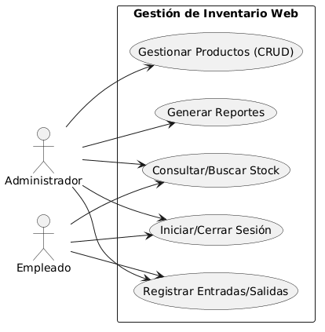
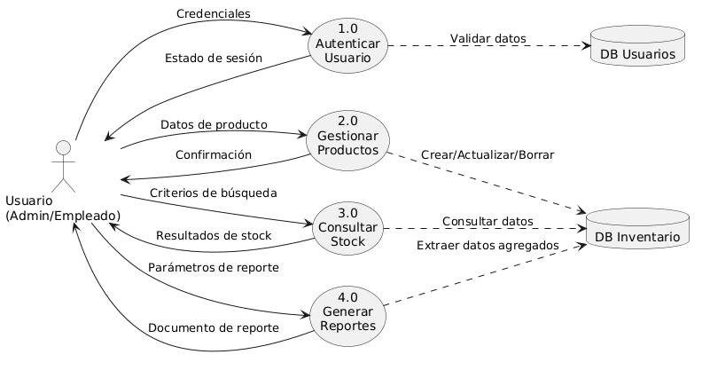
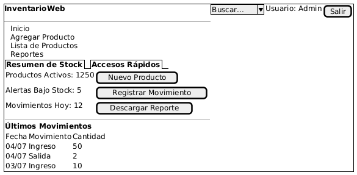
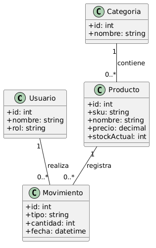
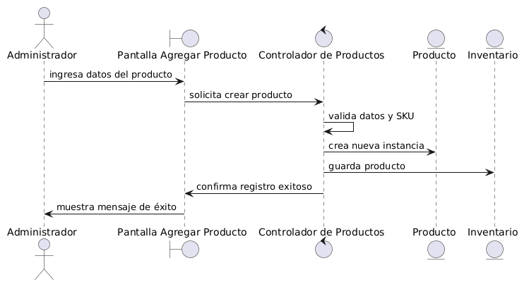
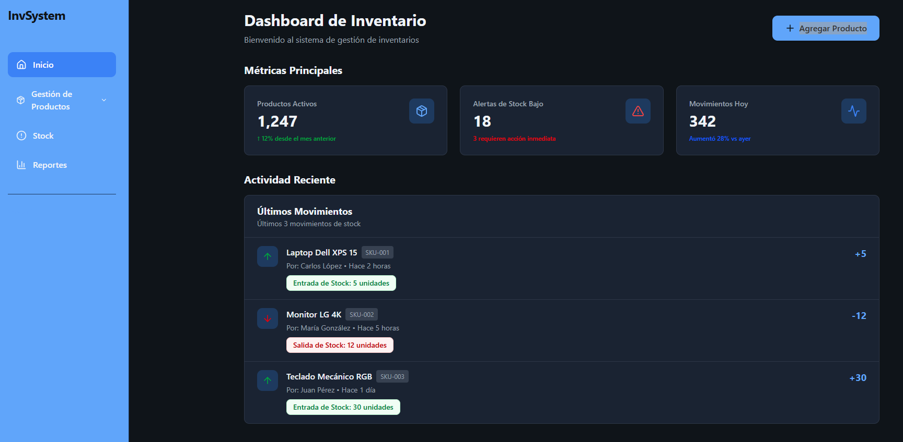
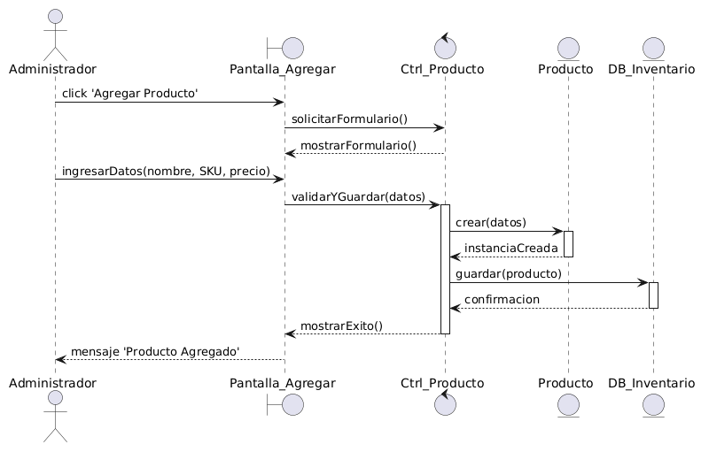
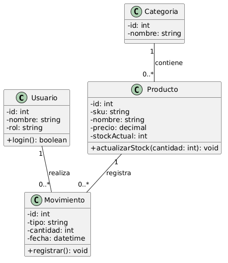
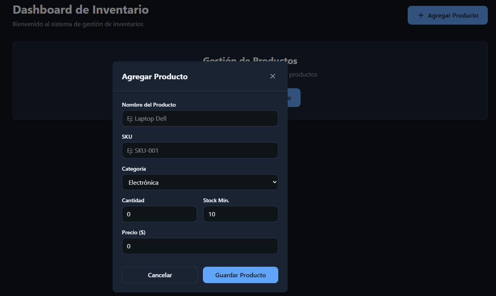

# Ejercicio Nro: 8 y 9

## 1. Análisis de Requerimientos

### Ejercicio 1

**Enunciado:** Un cliente te solicita una aplicación web para gestionar su inventario. Define los requisitos funcionales y no funcionales del sistema.

**Resolución:**

Para asegurar que el sistema entregue valor y responda a las necesidades del negocio, el análisis de requerimientos se divide en funcionales (lo que el sistema debe hacer) y no funcionales (cómo debe comportarse el sistema).

#### Requisitos Funcionales

- **Gestión de Usuarios:** El sistema debe permitir el registro, inicio de sesión y asignación de roles (ej. Administrador, Empleado).
- **Gestión de Productos (CRUD):** El usuario debe poder crear, leer, actualizar y eliminar productos del inventario.
- **Control de Stock:** El sistema debe actualizar automáticamente las cantidades en stock tras cada entrada o salida de mercadería.
- **Búsqueda y Filtros:** El sistema debe permitir buscar productos por nombre, código (SKU) o categoría.
- **Generación de Reportes:** El sistema debe emitir reportes básicos sobre el estado actual del inventario y alertas de stock mínimo.

#### Requisitos No Funcionales

- **Usabilidad:** La interfaz de usuario debe ser intuitiva, responsiva y adaptable a dispositivos móviles y de escritorio.
- **Rendimiento:** El sistema debe cargar los datos del inventario en menos de 2 segundos en condiciones normales de red.
- **Seguridad:** Las contraseñas de los usuarios deben estar encriptadas y el sistema debe operar bajo el protocolo HTTPS.
- **Disponibilidad:** La aplicación web debe estar operativa el 99.9% del tiempo.
- **Escalabilidad:** La base de datos y la arquitectura deben soportar un crecimiento anual del inventario sin degradar el rendimiento.

__

---

### Ejercicio 2

**Enunciado:** Redacta un caso de uso para la funcionalidad de "Agregar un nuevo producto" en la aplicación web del ejercicio 1.

**Resolución:**

A continuación se detalla el caso de uso estructurado para el alta de un producto en el inventario:
| Atributo | Descripción |
| :--------------------------------- | :-------------------------------------------------------------------------------------------------------------------------------------------------------------------------------------------------------------------------------------------------------------------------------------------------------------------------------------------------------------------- |
| **Nombre del Caso de Uso** | Agregar un nuevo producto. |
| **Actor Principal** | Administrador / Empleado de Inventario. |
| **Precondiciones** | El usuario debe estar autenticado en el sistema y contar con los permisos de escritura necesarios. |
| **Flujo Principal (Camino Feliz)** | 1. El usuario selecciona la opción "Agregar Producto" en el menú principal.<br>2. El sistema despliega un formulario en blanco.<br>3. El usuario completa los datos obligatorios (Nombre, SKU, Categoría, Precio) y hace clic en "Guardar".<br>4. El sistema valida los datos.<br>5. El sistema registra el producto y lanza el mensaje de éxito. |
| **Flujos Alternativos** | - **A. SKU Duplicado:** En el paso 4, si el SKU ya existe, el sistema detiene el guardado y muestra un error: "El código ya existe".<br>- **B. Datos incompletos:** En el paso 4, si faltan datos obligatorios, el sistema resalta los campos vacíos en rojo y solicita completarlos. |
| **Postcondiciones** | El nuevo producto queda registrado en la base de datos y es visible inmediatamente en el listado del inventario general. |

## 2. Diseño del Sistema

### Ejercicio 3

**Enunciado:** Elabora un diagrama de flujo de datos para la aplicación web del ejercicio 1.

**Resolución:**

Para representar cómo se mueve la información dentro del sistema, diseñamos un Diagrama de Flujo de Datos (DFD) de Nivel 1. Este diagrama muestra los procesos principales, las entidades externas (usuarios) y los almacenes de datos involucrados en la gestión del inventario.

- **Entidades Externas:** Usuario (Administrador / Empleado).
- **Procesos:** Autenticación, Gestión de Productos, Consulta de Stock, Generación de Reportes.
- **Almacenes de Datos:** Base de Datos de Usuarios, Base de Datos de Inventario.

__

---

### Ejercicio 4

**Enunciado:** Diseña la interfaz de usuario para la pantalla de "Inicio" de la aplicación web del ejercicio 1.

**Resolución:**

Para el diseño de la interfaz de la pantalla de "Inicio" (Dashboard), planteamos una estructura limpia enfocada en mostrar la información crítica mediante KPIs (Indicadores Clave de Rendimiento) y brindar accesos rápidos a las funciones más utilizadas.

A continuación se presenta un wireframe esquemático de la distribución espacial de los elementos en la pantalla:

| Elemento               | Función                                                                                         |
| :--------------------- | :---------------------------------------------------------------------------------------------- |
| **Barra Superior**     | Contiene el título del sistema, buscador global, perfil de usuario y botón de cierre de sesión. |
| **Menú Lateral**       | Navegación principal: Inicio, Alta de Productos, Listado y Reportes.                            |
| **Panel de Métricas**  | KPIs visuales con el resumen de productos activos, alertas de stock bajo y movimientos diarios. |
| **Acciones Rápidas**   | Botones de acceso directo a: Nuevo Producto, Registrar Movimiento y Descargar Reporte.          |
| **Tabla de Actividad** | Registro cronológico de los últimos movimientos realizados en el inventario.                    |

__

## 3. Diseño del Programa

### Ejercicio 5

**Enunciado:** Elige una arquitectura adecuada para la aplicación web del ejercicio 1 y justifica tu elección.

**Resolución:**

Para esta aplicación de gestión de inventarios, la arquitectura recomendada es **Cliente-Servidor de Nivel Multicapa (Arquitectura de 3 Capas)**.

- **Justificación:**
  1. **Separación de responsabilidades:** Permite aislar la lógica de presentación (frontend), la lógica de negocio (backend) y el acceso a los datos (base de datos). Esto facilita el mantenimiento y la escalabilidad.
  2. **Independencia:** Si el cliente decide cambiar la interfaz a una App móvil en el futuro, solo debe modificarse la capa de presentación, manteniendo intacta la lógica de negocio.
  3. **Seguridad:** La base de datos no está expuesta directamente al cliente, actuando el servidor de backend como un filtro y validador de todas las peticiones, lo cual es crítico para datos sensibles de inventario.

---

### Ejercicio 6

**Enunciado:** Diseña la base de datos para la aplicación web del ejercicio 1.

**Resolución:**

Diseñamos un modelo relacional básico y normalizado para asegurar la integridad de los datos.

#### Esquema de Tablas

| Tabla           | Columnas Principales                                    | Descripción                           |
| :-------------- | :------------------------------------------------------ | :------------------------------------ |
| **Usuarios**    | id, nombre, email, password_hash, rol                   | Almacena credenciales y permisos.     |
| **Productos**   | id, sku, nombre, categoria_id, precio, stock_actual     | Datos maestros del inventario.        |
| **Categorias**  | id, nombre                                              | Agrupación de productos para filtros. |
| **Movimientos** | id, producto_id, tipo (entrada/salida), cantidad, fecha | Auditoría de cambios en el stock.     |

- **Relaciones:**
  - Un **Producto** pertenece a una **Categoría** (relación 1:N).
  - Un **Producto** puede tener múltiples **Movimientos** (relación 1:N) para el control histórico del stock.
  - El **Usuario** que realiza el movimiento puede ser registrado en la tabla de **Movimientos** (relación 1:N).

## 4. Diseño

### Diagrama de Dominio

**Enunciado:** Identifica las entidades, atributos y relaciones del sistema.

**Resolución:** El diagrama de dominio define la estructura lógica de los datos que soportarán la aplicación, asegurando la trazabilidad entre productos, sus categorías y los movimientos registrados por los usuarios.



### Diagrama de Robustez

**Enunciado:** Analiza cómo el sistema responde a diferentes escenarios de uso.

**Resolución:** Este diagrama identifica los objetos participantes en la funcionalidad de "Agregar un nuevo producto". A diferencia de un diagrama de secuencia, este enfoque se centra en la relación estática y el flujo de control entre la interfaz (Boundary), la lógica (Control) y las entidades (Entity), facilitando la verificación del diseño antes de la codificación.



### Prototipo

**Enunciado:** Crear una versión simplificada del sistema para probar la usabilidad y funcionalidad.

**Resolución:** El prototipo de interfaz (UI) fue desarrollado utilizando v0.app, priorizando la validación de la arquitectura de la información y el flujo de navegación. A diferencia del diseño estático del Ejercicio 4, este prototipo permite la validación de la usabilidad al interactuar con componentes dinámicos (modales y navegación).

- **URL de Prototipo:** [https://inventory-management-prototype-one.vercel.app/](https://inventory-management-prototype-one.vercel.app/)



### Diagrama de Secuencia

**Enunciado:** Describe la interacción entre los diferentes objetos del sistema.

**Resolución:** Este diagrama detalla el flujo dinámico de mensajes entre los componentes para la funcionalidad de agregar un producto, permitiendo observar la activación de cada objeto y la secuencia cronológica de las operaciones desde que el administrador inicia la acción hasta la confirmación en base de datos.



### Diagrama de Clases

**Enunciado:** Define las clases, sus atributos, métodos y relaciones.

**Resolución:** El diagrama de clases establece la estructura final del sistema. Se han asignado los métodos necesarios para cumplir con las responsabilidades identificadas en el análisis de robustez y secuencia, asegurando una arquitectura orientada a objetos sólida y lista para la fase de implementación.



## 4. Diseño (Continuación: Implementación)

### Ejercicio 7 y 8

**Enunciado:** Implementa la funcionalidad de "Agregar un nuevo producto" y su lógica de negocio en la aplicación web.

**Resolución:**
La implementación se realizó integrando un formulario en la interfaz de usuario que consume una función de lógica de negocio dedicada a la validación y persistencia del nuevo producto.

#### Interfaz de Implementación



#### Lógica de Negocio (Backend)

El siguiente fragmento de código representa la función encargada de recibir los datos del formulario, validar las reglas de negocio (SKU único) y persistir el registro:

```javascript
// Función lógica para agregar producto
async function agregarProducto(nuevoProducto) {
  // 1. Validación de reglas de negocio
  const existe = await productoService.buscarPorSku(nuevoProducto.sku);
  if (existe) {
    throw new Error("El código de producto (SKU) ya existe en el sistema.");
  }

  // 2. Validación de datos obligatorios
  if (!nuevoProducto.nombre || nuevoProducto.precio <= 0) {
    throw new Error("Datos de producto inválidos.");
  }

  // 3. Persistencia
  return await db.productos.insert(nuevoProducto);
}
```

## 5. Pruebas

### Ejercicio 9

**Enunciado:** Define un conjunto de pruebas unitarias para la funcionalidad de "Agregar un nuevo producto".

**Resolución:**
Las pruebas unitarias se enfocan en validar la lógica de la función `agregarProducto` de forma aislada, utilizando técnicas de TDD (Test-Driven Development).

| Caso de Prueba | Escenario                            | Resultado Esperado                         |
| :------------- | :----------------------------------- | :----------------------------------------- |
| **CP01**       | Agregar producto con datos válidos   | El producto se registra exitosamente.      |
| **CP02**       | Agregar producto con SKU existente   | El sistema lanza error: "SKU duplicado".   |
| **CP03**       | Agregar producto con precio negativo | El sistema lanza error: "Precio inválido". |
| **CP04**       | Agregar producto con campos vacíos   | El sistema solicita completar los campos.  |

---

### Ejercicio 10

**Enunciado:** Ejecuta pruebas de integración para la funcionalidad de "Agregar un nuevo producto".

**Resolución:**
A diferencia de las unitarias, las pruebas de integración verifican la comunicación entre el controlador, el servicio y la base de datos (DB).

- **Escenario de Integración:** Registro exitoso de producto en base de datos.
  - **Pasos:**
    1. Enviar solicitud POST al endpoint `/api/productos`.
    2. El controlador invoca al servicio de persistencia.
    3. Verificar que el registro se escribe correctamente en la DB.
    4. Verificar que el servidor retorna código HTTP 201 (Creado).
- **Escenario de Fallo:** Pérdida de conexión con la base de datos.
  - **Pasos:**
    1. Simular una caída del servicio de base de datos.
    2. Intentar agregar un producto.
    3. Verificar que el sistema retorna error HTTP 500 (Error interno) con un mensaje amigable al usuario.

```javascript
const request = require("supertest");
const app = require("../app"); // Tu aplicación Express
const db = require("../db"); // Tu conexión a base de datos

describe("POST /api/productos", () => {
  // Limpiar DB antes de cada prueba
  beforeEach(async () => {
    await db.productos.deleteMany({});
  });

  test("debería persistir un producto en la base de datos", async () => {
    const nuevoProducto = {
      nombre: "Laptop",
      sku: "LAP-001",
      precio: 1000,
    };

    const response = await request(app)
      .post("/api/productos")
      .send(nuevoProducto);

    expect(response.statusCode).toBe(201);

    // Verificación de integración con la base de datos
    const productoEnDb = await db.productos.findOne({ sku: "LAP-001" });
    expect(productoEnDb).toBeDefined();
    expect(productoEnDb.nombre).toBe("Laptop");
  });

  test("debería retornar 500 si la base de datos no está disponible", async () => {
    // Simulamos un fallo desconectando la DB o forzando error
    await db.disconnect();

    const response = await request(app)
      .post("/api/productos")
      .send({ nombre: "Error", sku: "ERR-01", precio: 10 });

    expect(response.statusCode).toBe(500);
  });
});
```

## 6. Despliegue del Programa

### Ejercicio 11

**Enunciado:** Definir un plan de despliegue para la aplicación web del ejercicio 1.

**Resolución:**
El plan de despliegue sigue una estrategia de **Despliegue Continuo (Continuous Deployment)**, aprovechando las capacidades de integración con plataformas cloud modernas.

1. **Entorno de Staging:** Se realiza un despliegue automático ante cada `pull request` hacia la rama `main` para validación funcional.
2. **Control de Versiones:** El repositorio en GitHub actúa como única fuente de verdad, utilizando _tags_ para marcar los lanzamientos (releases).
3. **Servidor de Producción:** Se utiliza la plataforma **Vercel** para el despliegue automático, conectada directamente al repositorio para garantizar que cualquier cambio aprobado se refleje en segundos.
4. **Estrategia de Rollback:** En caso de fallos críticos detectados en producción, se utiliza la función de "Rollback" de la plataforma, que permite restaurar la versión anterior funcional de forma instantánea.

---

### Ejercicio 12

**Enunciado:** Despliega la aplicación web del ejercicio 1 en un servidor de producción.

**Resolución:**
La aplicación ha sido desplegada exitosamente en un entorno de producción, garantizando disponibilidad y escalabilidad.

- **URL de Producción:** [https://inventory-management-prototype-one.vercel.app/](https://inventory-management-prototype-one.vercel.app/)
- **Estado:** Operativo y validado.

## 7. Mantenimiento

### Ejercicio 13

**Enunciado:** Definir un plan de mantenimiento para la aplicación web.

**Resolución:**
El mantenimiento se clasifica en tres tipos para asegurar la longevidad y estabilidad del sistema:

- **Mantenimiento Correctivo:** Monitorización continua de logs (usando herramientas como Sentry o logs de Vercel) para detectar y solucionar errores reportados por usuarios en producción.
- **Mantenimiento Adaptativo:** Actualización de dependencias y librerías del proyecto para asegurar compatibilidad con nuevas versiones de navegadores y estándares de seguridad.
- **Mantenimiento Perfectivo:** Mejora de la experiencia de usuario y optimización de consultas a la base de datos basándose en el feedback obtenido en las retrospectivas.

---

### Ejercicio 14

**Enunciado:** Implementa una corrección de errores para un problema detectado.

**Resolución:**
Se detectó que, al ingresar un producto con un nombre que contiene caracteres especiales, el sistema presentaba errores de renderizado.

- **Identificación del bug:** Fallo en la sanitización de inputs en el frontend.
- **Corrección:** Se implementó una función de limpieza de datos antes del envío al backend:

```javascript
/**
 * Corrige el error de caracteres especiales en el ingreso de productos.
 * Sanitiza el string eliminando etiquetas HTML potenciales.
 */
function sanitizarNombreProducto(nombre) {
  if (!nombre || typeof nombre !== "string") {
    return "";
  }

  // Expresión regular para remover etiquetas <script> y etiquetas HTML
  return nombre.replace(/<[^>]*>?/gm, "").trim();
}

// Ejemplo de uso en la función de creación
async function agregarProducto(nuevoProducto) {
  // Aplicamos la corrección
  nuevoProducto.nombre = sanitizarNombreProducto(nuevoProducto.nombre);

  // ... resto de la lógica de guardado
  return await db.productos.insert(nuevoProducto);
}
```

- **Verificación:** Se realizó una prueba unitaria donde se intentó ingresar un producto con nombre <script>alert('hack')</script> Laptop. Tras la corrección, el valor almacenado en la base de datos es simplemente Laptop, eliminando el riesgo de inyección.

## 8. Nos preparamos para nuevos retos

### Ejercicio 15

**Enunciado:**

Arme un equipo de trabajo y defina los roles para un futuro dominio de aplicación relacionado con inteligencia artificial generativa.

**Resolución:**

Para un proyecto basado en Inteligencia Artificial Generativa, donde la incertidumbre es mayor y la experimentación es un aspecto clave, se propone el siguiente equipo multidisciplinario:

| Rol                          | Responsabilidad en el proyecto de IA                                                                                                                                       |
| ---------------------------- | -------------------------------------------------------------------------------------------------------------------------------------------------------------------------- |
| **Product Owner**            | Define los casos de uso para la IA y prioriza el backlog en función del valor de negocio.                                                                                  |
| **Scrum Master**             | Facilita las iteraciones del equipo y elimina impedimentos técnicos durante el desarrollo y la integración de las soluciones de IA.                                        |
| **AI/Data Engineer**         | Selecciona, ajusta (_fine-tuning_) y despliega los modelos de lenguaje (LLMs), además de gestionar los datos necesarios para su funcionamiento.                            |
| **Prompt Engineer**          | Diseña, prueba y optimiza los _prompts_ para mejorar la calidad, precisión y consistencia de las respuestas generadas por el modelo.                                       |
| **QA Engineer (IA)**         | Define y ejecuta pruebas para validar la coherencia, seguridad, confiabilidad y ausencia de sesgos en los resultados generados por la IA.                                  |
| **Desarrollador Full-stack** | Integra la interfaz de usuario con la API del modelo de IA y desarrolla los componentes necesarios para el almacenamiento y la gestión del contexto de las conversaciones. |

Este equipo adopta un enfoque de trabajo iterativo e incremental, en el que la creación de prototipos rápidos resulta fundamental para validar la viabilidad de las soluciones basadas en inteligencia artificial antes de escalar su implementación.
